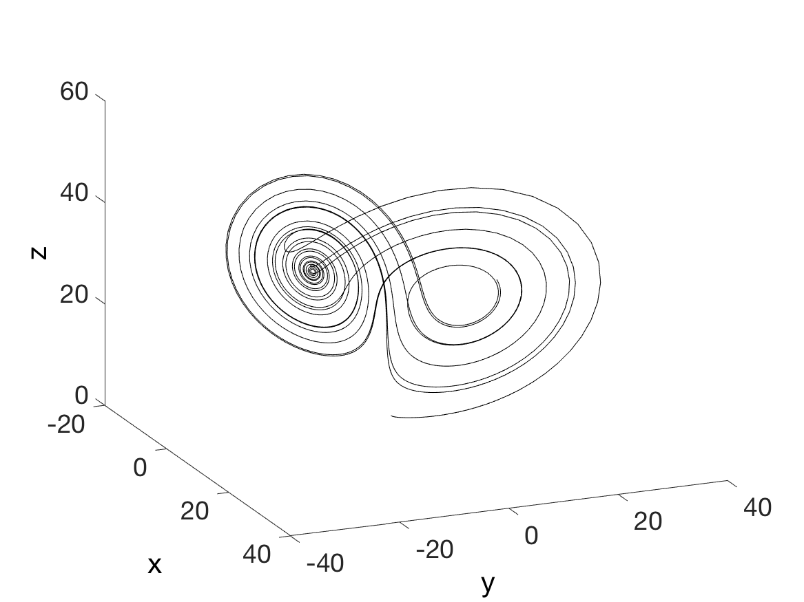
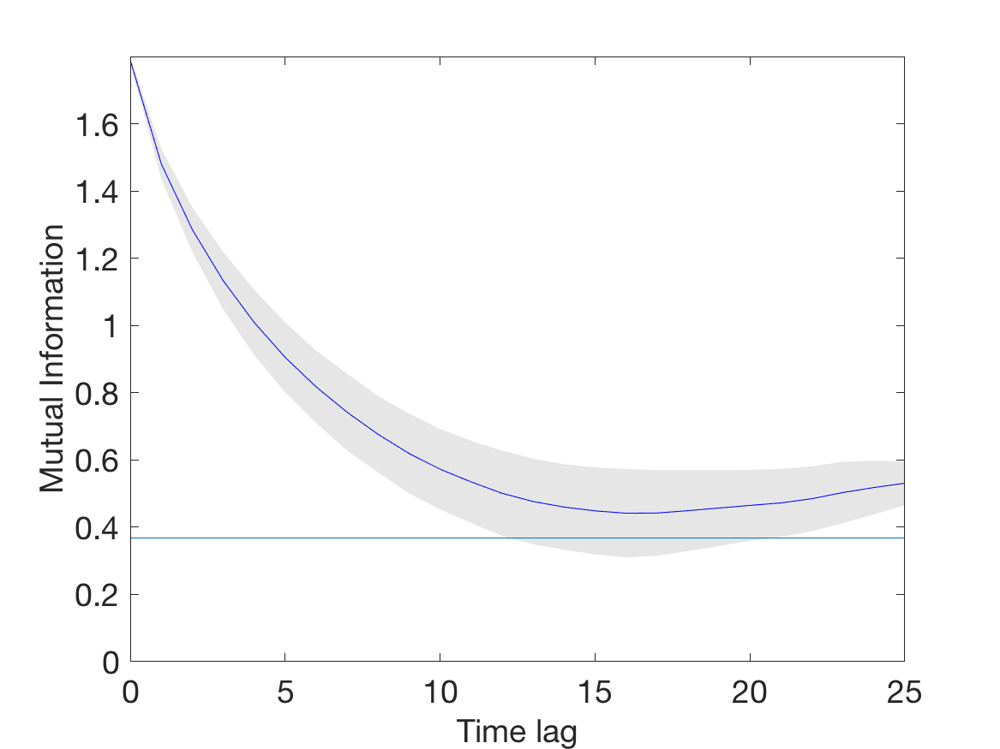

# Estimation of embedding parameters for multivariate data
This repository contains MATLAB code for estimating parameters for phase space reconstruction of multivariate data. The functions provided in this repository are described in the article:
> Wallot & Mønster (2018) Calculation of average mutual information (AMI) and false-nearest neighbors (FNN) for the estimation of embedding parameters of multidimensional time-series in MATLAB *Frontiers in Psychology, 9: 1679* [DOI:10.3389/fpsyg.2018.01679](https://dx.doi.org/10.3389%2Ffpsyg.2018.01679)

## Installation
The functions in this repository can be used if you place the files containing them in a directory that is in your MATLAB Path. You can simply download [mdDelay.m](mdDelay.m), [autoMI.m](autoMI.m) and [mdFnn.m](mdFnn.m) or you can clone the whole repository to get all the files and examples:
```
git clone https://github.com/danm0nster/mdembedding.git mdembedding
```
If you want your cloned copy in a different directory you can change the last parameter to something else, e.g. `mde-copy`.

To embed time series data using the time-delayed embedding method two parameters are needed: the time delay and the embeddding dimension. We provide two functions to estimate these parameters: `mdDelay()` and `mdFnn()`.

## Example
This is a short example of how to use the functions using the well-known Lorenz attractor. The data have been pre-generated and the MATLAB code for generating the plots can be found in this repository under docs/Lorenz, and you can also view the full [output of the MATLAB notebook](https://danm0nster.github.io/mdembedding/Lorenz/html/). Here, we will just show the basic commands used to produce plots and other outputs.

We start by loading the data generated by a numerical solution to the Lorenz equations
```MATLAB
data = load('lorenz_3d_timeseries.txt');
```

The data can be visualized by plotting the three variables x, y and z.
```MATLAB
plot3(data(:,1), data(:,2), data(:,3), 'k')
```



### Estimating the time delay
To estimate the proper time delay for embedding the data we use the function `mdDelay`.
```MATLAB
tau = mdDelay(data, 'maxLag', 25, 'plottype', 'all');
```


This gives a value of `tau` that rounds to 15. A visual inspection of the plot of mutual information indicates that this is a reasonable value, since all three curves have minima close to that value. Alternatively we can get `mdDelay()` to plot the mean mutual information, by setting the plot type to "mean".
```MATLAB
tau = mdDelay(data, 'maxLag', 25, 'plottype', 'mean');
```


### Estimating the embedding dimension
The optimal embedding dimension is estimated using the method of false nearest neighbors (FNN), which is implemented in the function `mdFnn()`. We call this function with the value of `tau` found above rounded to nearest integer (in this case 15). The function returns a vector with the percent of FNN and another vector with the corresponding embedding dimensions.
```MATLAB
[fnnPercent, embeddingDimension] = mdFnn(data, round(tau));
```


Since the number of false nearest neighbors drops to zero already at 2 embeddings we see that it is enough to embed the data in the three dimensions already present in the data, which is not surprising because we have sampled all the variables in the dynamical system.

## Testing the functions
You can run a short test suite for the functions by typing the following command in the MATLAB command window.
```MATLAB
runtests('tests/mdDelayTest.m')
```
If the test is successful you should see something like the output below.
```
Running mdDelayTest
No value below threshold found. Will use first local minimum instead
.No value below threshold found. Will use first local minimum instead
No value below threshold found. Will use first local minimum instead
.No value below threshold found. Will use first local minimum instead
No value below threshold found. Will use first local minimum instead
No value below threshold found. Will use first local minimum instead
No value below threshold found. Will use first local minimum instead
No value below threshold found. Will use first local minimum instead
.Teardown called. No action taken here.

Done mdDelayTest
__________


ans =

  1×3 TestResult array with properties:

    Name
    Passed
    Failed
    Incomplete
    Duration
    Details

Totals:
   3 Passed, 0 Failed, 0 Incomplete.
   0.097622 seconds testing time.

```

## How to cite
If you find these functions useful and publish results where you have used them, please cite our paper:

Wallot & Mønster (2018) Calculation of average mutual information (AMI) and false-nearest neighbors (FNN) for the estimation of embedding parameters of multidimensional time-series in MATLAB *Frontiers in Psychology, 9: 1679* [DOI:10.3389/fpsyg.2018.01679](https://dx.doi.org/10.3389%2Ffpsyg.2018.01679)
